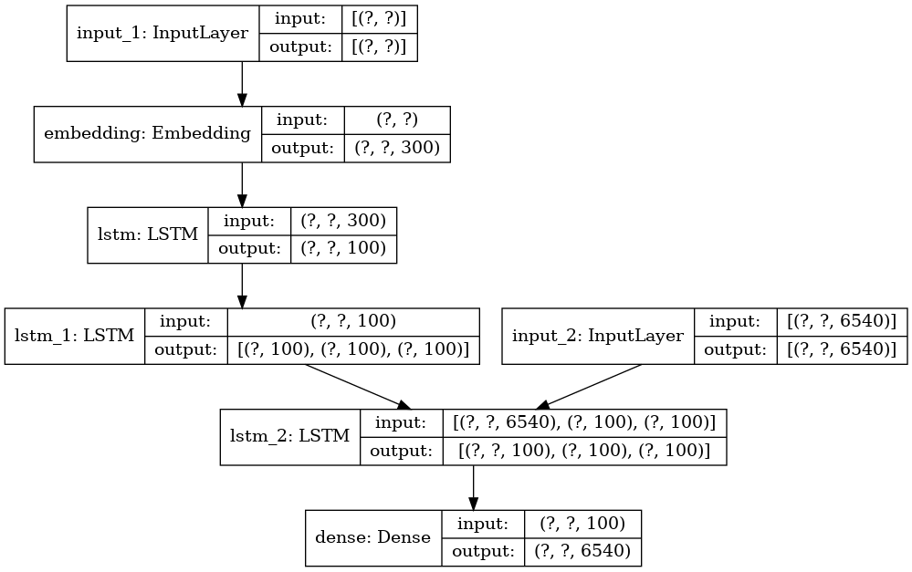
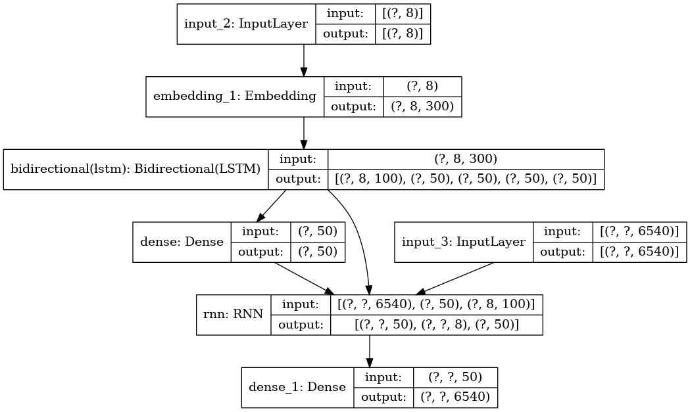

# Machine Translation
By - Pranav Goyal

## Papers Implemented:
1. **Sequence to Sequence Learningwith Neural Networks** by *Sutskever et al*
   * Code: 1_Seq2Seq.ipynb
    
2. **Neural Machine Translation by Jointly Learning to Align and Translate** by *Bahdanau et al*
   * Code: 2_Seq2Seq-attention.ipynb
   

## Results
Translated results of both models can be found in `results/test_seq2seq_with_attention.csv`